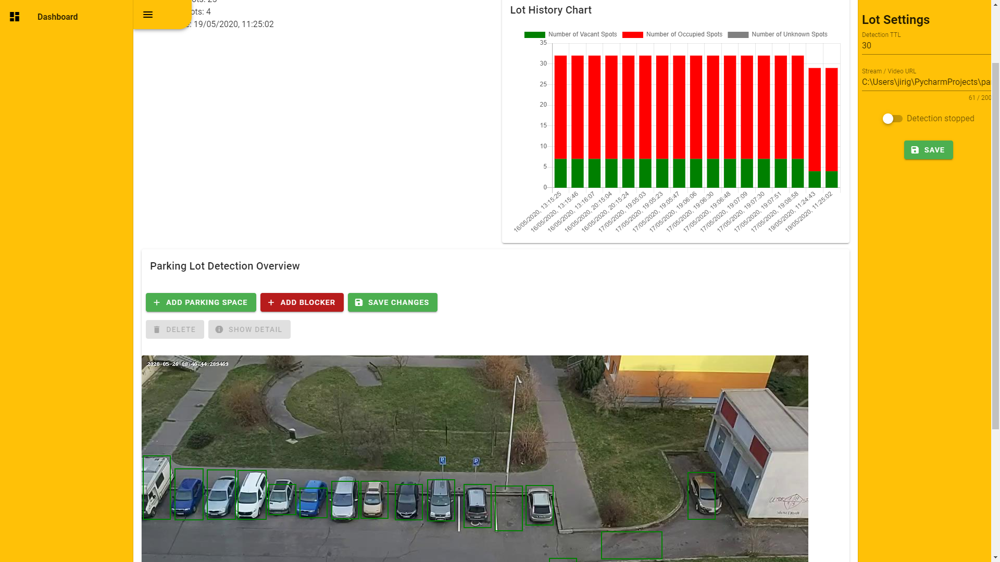

# Parking lot detection system
The goal of this masters thesis was to design and implement a system that can
process the video stream of a parking lot camera, extract locations of parking
spots using the parked vehicles and determine the occupancy status of the
parking lot.The system is composed of several services and a processing pipeline that
periodically takes an image from the stream, locates the vehicles using object
detector and performs time based sampling in order to filter out moving vehicles
and eventually acknowledge the parking spots. Acknowledged parking
spots are periodically evaluated for occupancy status by a custom classifier.

## Introduction
This system composes of several components that form a pipeline for evaluating a parking lot from a camera.

Images are taken from the camera specified for the parking lot and object detector is used to find locations
of vehicles. Vehicles are used as a point of reference in order to get the parking spots. Parking spots are then
classified on the newest snapshot from camera using custom trained classifier. Results are presented on a 
web page. 

## Thesis
The source of the masters thesis can be found in following repo. https://github.com/grohj/Park-Detector-Thesis

